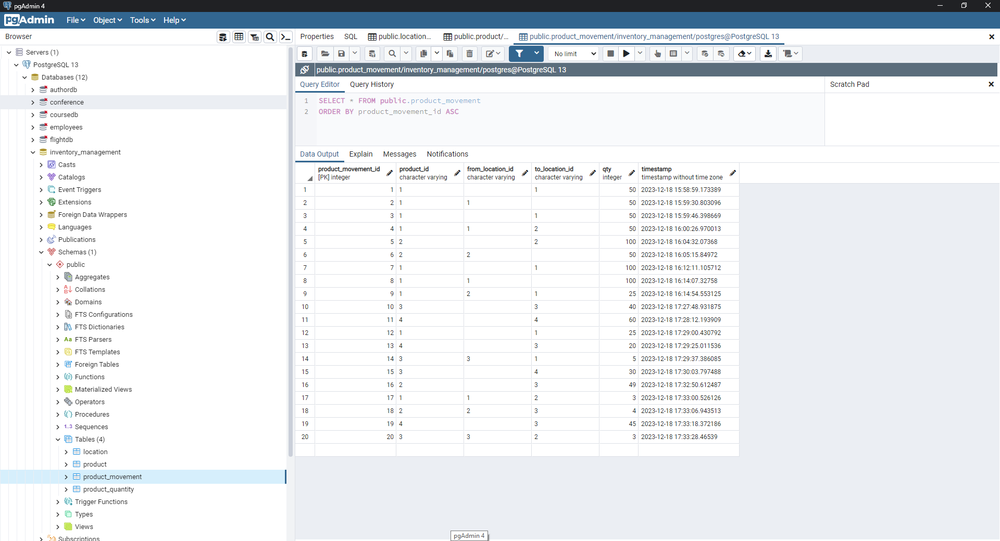

# Inventory Management APIs

## Features
1. Add/Edit/View Product
2. Add/Edit/View Location
3. Add/Edit/View ProductMovement : Product Movement in and out of a location, product movement between locations.

## API collection
Import the file Inventory Management.postman_collection.json

## Screenshots

